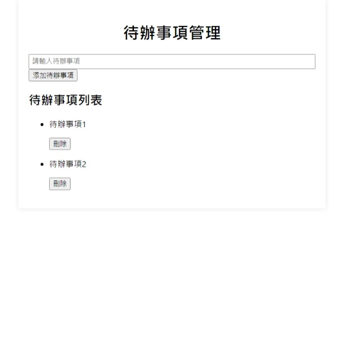

# 待辦事項管理應用

這是一個簡單的待辦事項管理應用，使用React前端框架和Node.js後端實現。允許用戶新增、檢視、刪除待辦事項。

## 功能

- 新增待辦事項
- 檢視所有待辦事項列表
- 刪除待辦事項

## 技術堆疊

- 前端：React
- 後端：Node.js, Express
- 資料庫：MongoDB

## 本地測試

1. 啟動後端服務
```bash
cd backend
node index.js
```

2. 啟動前端應用
```bash
cd todo-frontend
npm start --open
```

3. 開啟 http://localhost:3000 開始測試


